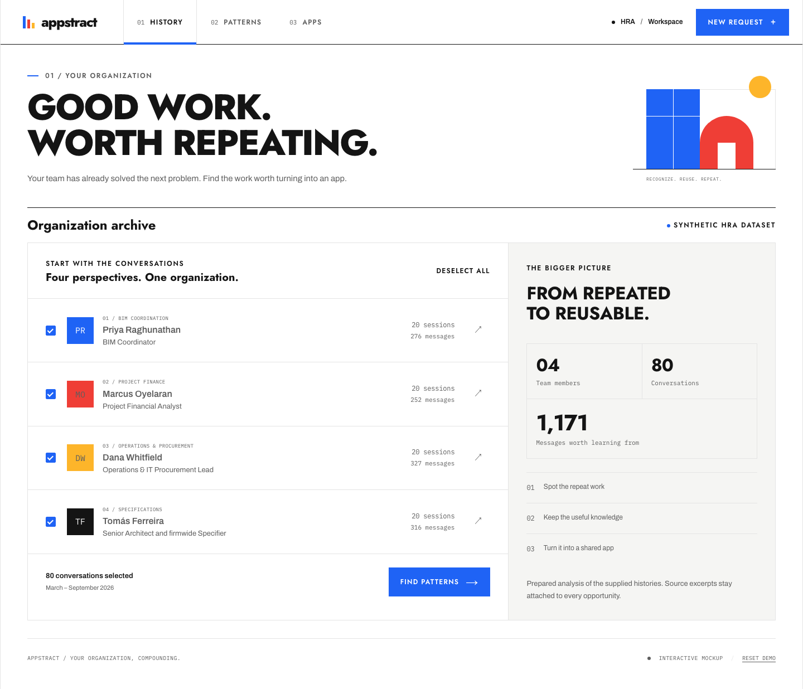
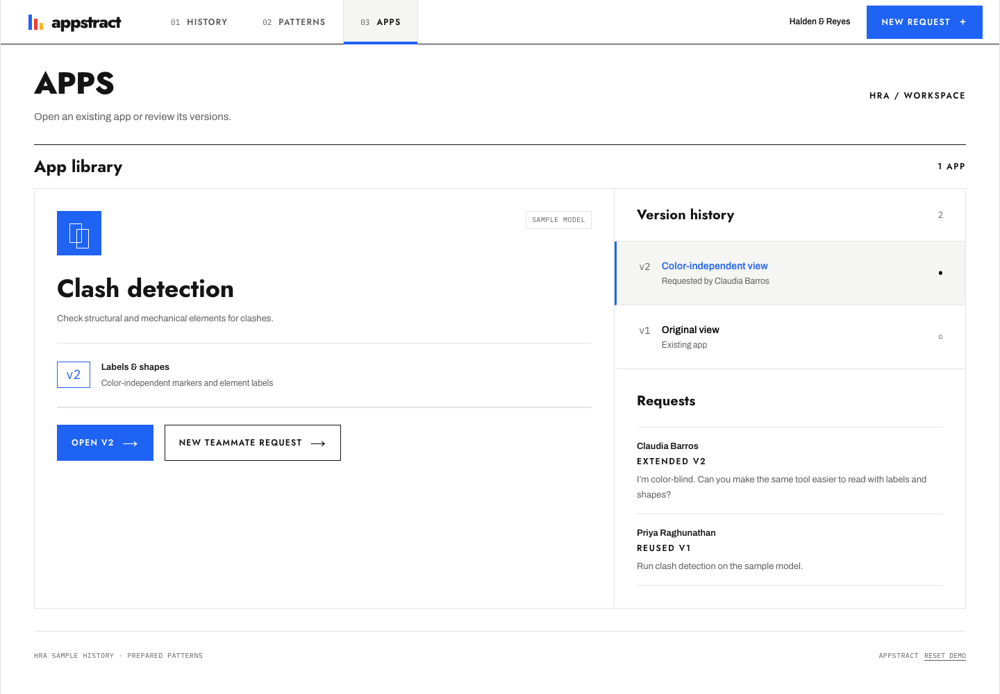

# Appstract

Interactive Modul mockup for finding recurring organizational work and reusing a teammate's app.

## Run

Use Node 22.12+ (built here with Node 26.3.1).

```bash
npm ci
npm run dev
```

Appstract runs at `http://127.0.0.1:5174`. Start the separate clash app on port **5186**; Appstract discovers its manifest automatically. There is no Connect or registration step. For production previews, Appstract uses **4174** and expects the clash app on **4186**. Ports are fixed; an occupied parent port produces an error.

```bash
npm test
npm run build
npm run preview
```

For a different app address, copy `.env.example` to `.env.local` and set `VITE_CLASH_APP_URL`, then restart Vite. The legacy `VITE_DEMO_APP_URL` remains a fallback. These are public app addresses, never secrets. Cross-origin manifest requests must be allowed by the clash app's server.



[Pattern selection and automatic app discovery](docs/mockup-patterns.png)

## Try vendor approval

Vendor approval is bundled at `/apps/vendor-approval/`; it needs no separate server or environment variable.

1. Select Dana's history → **Find patterns** → a vendor review workflow. Without QM, use **View prepared examples** → **Vendor review scorecard**.
2. **Open app** launches Vendor approval v1 beside the original source evidence.
3. **Submit vendor** → **Research and prepare submission** → **Confirm and start review**.
4. Complete required documents and security checks, then approve or reject the sample vendor.
5. **Back to Appstract** returns to the request view. Ask “Review vendor documents and security checks for approval” to reuse v1.
6. In **Apps**, switch between Clash detection and Vendor approval. Each has separate versions and request history.

The vendor demo uses simulated research and browser-local sample data. Its Reset demo only resets vendor records. See [source attribution and integration notes](apps/vendor-approval/README.md).

## Try the clash two-person flow

1. [Connect the QM history input](docs/qm-discovery.md), select histories → **Find patterns** → select a discovered clash-coordination workflow. Without QM, use the explicitly labeled **View prepared examples** path. Appstract checks the running app and shows **Existing app found** beside the source evidence.
2. Click **Open app** to run v1. Navigation stays in the same tab and passes the pinned version to the separate app.
3. Use the app's **Back to Appstract** link. Choose another teammate and ask: “I'm color-blind. Can you make the same tool easier to read?”
4. **Find app** → **Extend app & open v2**. The same app opens with labels, shapes and non-color markers.
5. Return to inspect both versions and requester history. Repeat the request to reuse v2; reopen v1 from version history. Refresh retains browser-local state.

If the app is offline or its manifest is invalid, discovery shows an error and Retry. It does not create a replacement app. Rediscovery updates the address while preserving valid saved versions and their requester. Reset clears this browser's demo state; the running app can be discovered again.

## What this proves

QM is a live history input. Appstract reads the seeded synthetic conversations from QM and displays locally saved model analysis, verifying exact user-turn citations against the current source. The demo includes 80 sessions and 1,171 messages. Four prepared opportunities remain separately available as examples.

Vercel serves the frontend and a narrow API proxy to an authenticated local bridge. The Mac, QM and tunnel must remain running. Public clicks do not start model work. See [QM setup and demo limits](docs/qm-discovery.md).

App routing uses deterministic rules. Version 2 is an allowlisted **configuration extension**, not newly generated code. Persona selection simulates teammates; it is not authentication. The separate clash app owns sample geometry, computation and result UI. The bundled vendor app owns sample intake, review and approval state. Appstract owns discovery, request routing and browser-local version/request history. GBrain is not connected.

## Main files

| File | Responsibility |
|---|---|
| `src/App.tsx` | Views, discovery progress, requests and local persistence |
| `server/qm-input.ts` | Read seeded conversations from QM |
| `server/analyzer.ts` | Local model analysis of imported histories |
| `api/discovery/` | Vercel proxy to the authenticated bridge |
| `server/patterns.ts` | Transcript prompts and source citation verification |
| `server/discovery.ts` | Authenticated bridge and local Vite endpoints |
| `server/discovery-service.ts` | Verify saved analysis against live histories |
| `src/catalog.ts` | App identities and pattern-to-app descriptions |
| `src/storage.ts` | Multi-app persistence and migration of existing clash history |
| `apps/vendor-approval/` | Bundled vendor demo and original behavior tests |
| `src/registry.ts` | Manifest discovery, errors and saved-version reconciliation |
| `src/domain.ts` | Routing, versions, validation and launch URLs |
| `src/data.ts` | Prepared patterns and original source excerpts |
| `src/styles.css` | Modul styling and responsive layout |
| `chat-histories/json/` | Supplied synthetic conversations |

Fonts and histories are bundled locally. The bundled corpus produces a large-chunk build warning.

## References and verification

- [QM setup and verification limits](docs/qm-discovery.md)
- [Vercel deployment and QM hosting boundary](docs/vercel-deployment.md)
- [App integration contract](docs/app-integration-contract.md)
- [Build plan](docs/hackathon-plan.md)
- [Modul design system](DESIGN.md)
- [Rehearsal checklist](docs/hackathon-test-plan.md)
- [Deferred work](TODOS.md)

The integration has parent domain/discovery/storage/bridge tests and vendor behavior tests. `npm run build` emits both apps. Vendor browser verification covers pattern launch, intake, gated approval, refresh, return and request reuse.

Prior clash verification covered: automatic discovery → v1 → second teammate request → v2, repeat reuse, saved versions after return, reopening v1, incompatible XML requests, storage failure, and 320px layouts. The generated app has 67 passing tests. Headless browser verification used the plan fallback because WebGL was unavailable.

Domain, registry, input and bridge tests and the production build pass. The synthetic corpus was read back from real QM and checked against the original turns. The existing cross-app flow was previously verified by the coordinating agent, including v1/v2, repeat reuse, persistence, incompatible input and narrow layouts. Headless browser verification of the child app uses the plan fallback when WebGL is unavailable.


