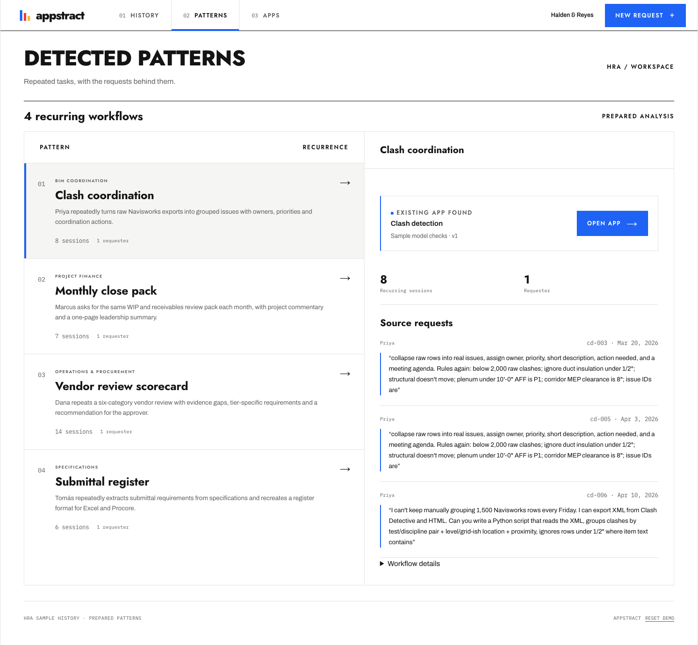
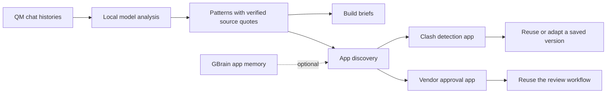

# Appstract

### CAPTURE THE INTELLIGENCE — AUTOMATICALLY

*In tools, apps & repeatable outputs — not bespoke LLM calls.*

Built for the **YC Own Your Intelligence hackathon**.

Your team's chat history is full of work worth keeping: the same report rebuilt every month, the same vendor checks repeated with new inputs, the same script written and lost. Appstract turns those recurring workflows into opportunities for reusable software, then helps teammates discover and adapt what already works.

**[Try the demo →](https://appstract-nine.vercel.app)**

## The idea

**MONITOR** existing chat activity → **IDENTIFY** repeated inputs, actions and outputs → **BUILD** tools, apps and output automations → **DISCOVER & ADAPT** use or modify what already works.

| Stage | What Appstract makes possible | Hackathon implementation |
|---|---|---|
| **Monitor** | Learn from work people are already doing. | Read a seeded synthetic chat corpus through QM, with selectable histories and source provenance. |
| **Identify** | Find repeated workflows, rules, output formats and lost scripts. | Model-analyzed patterns with exact source quotes, plus a signals explorer with evidence and build briefs. |
| **Build** | Capture the useful logic in a tool, app or repeatable output. | Turn opportunities into concrete build briefs; demonstrate working clash detection and vendor approval apps. |
| **Discover & adapt** | Make one person's solution useful to the next person. | Manifest-based app discovery, optional GBrain app memory, request routing and a versioned accessibility adaptation. |

The goal is to make intelligence accumulate in software your team can inspect, reuse and improve. A good answer should become a lasting capability.


## Follow one workflow from chat to app

1. **Find the repetition.** Select Priya's BIM coordination history and choose **Find patterns**. The ledger lists each recurring job with its measured sessions, tokens and chat time, the signals behind it and its cadence across the corpus; expand a row for the source conversations and the proposed tool. The separately labeled prepared examples offer a repeatable demo path when QM is unavailable.
2. **Build the tool.** Appstract checks the clash app's manifest and offers **Build app** to the first teammate through the flow. Build v1 to inspect the sample building and its clashes. Once a version exists, the action becomes **Open app** and the panel reports **Existing app found**.
3. **Bring in a teammate.** Return with **Back to Appstract**, choose another teammate and ask: “I'm color-blind. Can you make the same tool easier to read?”
4. **Adapt what works.** Choose **Find app** → **Extend app & open v2**. The same tool opens with labels, shapes and non-color markers.
5. **Keep both versions.** Return to see the requester and version history. Repeat the request to reuse v2, or reopen v1. Refresh preserves the browser-local history.

The clash app is a [separate application](https://appstract-clash-detection.vercel.app). It owns the sample geometry, clash computation and result interface; Appstract owns discovery, routing and version history. This example uses sample geometry, rather than importing the Navisworks XML described in the source opportunity.



## More than one app

**Vendor approval** connects Dana's recurring procurement work to a reusable review workflow: vendor intake, required documents, security checks, human approval and activity history. The app includes 14 sample vendors and retains records locally in the browser. Approval requires accepted mandatory documents and completed security checks. Company research and document requests are simulated; no vendor is contacted.

The vendor app is bundled at `/apps/vendor-approval/` and includes a return link to Appstract. It was adapted from [Bauhaus Vendor Approval](https://github.com/alexselig/bauhaus-vendor-approval). Its current scope is intake and approval tracking; the full six-category scorecard described in Dana's conversations remains an opportunity.

**GBrain app memory** adds optional local write/search discovery for the validated clash app. With the GBrain CLI configured, Appstract saves an app record and searches it when a teammate submits a request. A result must match the validated manifest's app ID. If GBrain is unavailable, the UI shows **Local catalog fallback** and keeps the deterministic discovery flow working.

## The evidence behind the demo

The [chat-history corpus](chat-histories/README.md) follows four people at Halden & Reyes Architects, a fictional architecture firm: **80 sessions and 1,171 messages** across roughly six and a half months.

| Person | Repeated work | Reusable output opportunity |
|---|---|---|
| Priya · BIM coordination | Group clashes and prepare weekly coordination updates | Issue reports, tracker CSVs and meeting agendas |
| Marcus · Project finance | Rebuild monthly WIP, receivables and close reviews | Close packs and leadership summaries |
| Dana · Operations & procurement | Repeat vendor evidence and security reviews | Scorecards and approval workflows |
| Tomás · Specifications | Extract requirements and repeat submittal reviews | Registers and structured review comments |

The **signals explorer** expands this into nine curated opportunities. Each connects source sessions and transcript excerpts to proposed inputs, rules, outputs and a build plan. It highlights repeated context, fixed cadences, repeated output formats, rules re-taught, lost scripts, copy-paste round trips and quality drift.

Generate the standalone explorer:

```bash
node findings/build.mjs
open findings/dist/signals.html
```

Its **Build tool** action queues an opportunity locally and copies a build brief for a coding agent. Token counts are estimates and time metrics come from the synthetic conversations; they are not measured customer savings. This page is separate from the default Vite production build.

## How it works



**QM supplies the history; Appstract performs the analysis.** The demo imports the synthetic corpus into QM and reads it through QM's portal API. A local Codex analyzer produces saved patterns. On discovery, Appstract checks the current input fingerprint and verifies exact quotes against user turns from at least two distinct sessions. The UI identifies the source and shows read/analysis timestamps. Changed inputs invalidate the saved results.

For the hosted demo, Vercel serves the frontend and a narrow API proxy to a token-authenticated local bridge over an HTTPS tunnel. The local QM instance, bridge and tunnel must stay running. Public visitors read validated results; clicking **Find patterns** does not start a new model run. GBrain's optional CLI adapter runs locally through the development/preview server.

App manifests describe supported fixtures and presentations. Discovery validates that contract before launch; unavailable apps show an error and retry. Saved versions preserve the selected configuration and requester. The clash app's v2 changes presentation while retaining the same computation.

## Run locally

Use **Node 22.12+** and npm.

```bash
npm ci
npm run dev
```

Open the local URL printed by Vite. The vendor approval app runs from the same server. For clash detection, run the [separate clash repository](https://github.com/franmaranchello/bauhaus-clash-detection) on port **5186** for development or **4186** for preview, or point Appstract at a hosted instance:

```bash
cp .env.example .env.local
# Set VITE_CLASH_APP_URL to the clash app's root URL, then restart Vite.
```

The clash server must allow cross-origin manifest requests and accept the parent origin for its return link. `VITE_CLASH_APP_URL` is public configuration; `VITE_DEMO_APP_URL` remains a legacy fallback.

Follow the [QM setup guide](docs/qm-discovery.md) to configure the local test instance and analyzer. The demo lifecycle is:

```bash
npm run qm:seed       # Import the synthetic histories into QM.
npm run qm:analyze    # Analyze histories and save validated results locally.
npm run qm:bridge     # Serve the authenticated bridge on 127.0.0.1:5176.
```

QM and bridge credentials belong on the server, never in `VITE_` variables. The hosted proxy additionally needs the bridge URL and token configured server-side. Prepared examples remain available without QM; optional GBrain discovery requires an installed, configured `gbrain` CLI.

```bash
npm test
npm run build
npm run preview
```

## What the hackathon demonstrates

The demo connects source evidence to reusable applications, then shows how a teammate can find and adapt an existing tool. It includes live reads from QM, saved model analysis, manifest validation, working sample apps, optional local app memory and persistent browser-local version/request history.

Automatic continuous monitoring, arbitrary app generation and production deployment from a discovered pattern are the larger product direction. Today, the corpus is a fixed synthetic import, build briefs hand off to a coding agent, and the app integrations are curated. The accessibility extension is an allowlisted configuration change. Persona selection simulates teammates; it is not authentication. Private connectors, multi-tenant access, durable hosted analysis and automatic refresh remain future work.

## Explore the repository

- [Chat histories and schema](chat-histories/README.md) — the source material.
- [Signals explorer](findings/README.md) — opportunities, evidence and build briefs.
- [QM setup and demo architecture](docs/qm-discovery.md) — history import, analysis and the authenticated bridge.
- [App integration contract](docs/app-integration-contract.md) — manifests, launches and version behavior.
- [Deployment notes](docs/vercel-deployment.md) — hosting setup and dated verification records.
- [Modul design system](DESIGN.md) — visual language.
- [Rehearsal checklist](docs/hackathon-test-plan.md) — demo verification.


